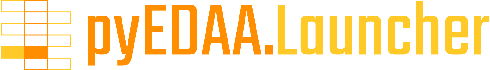

.. include:: shields.inc

.. raw:: html

     

.. raw:: latex

   \part{Introduction}

.. only:: html

   |  |SHIELD:svg:Launcher-github| |SHIELD:svg:Launcher-ghp-doc| |SHIELD:svg:Launcher-gitter|
   |  |SHIELD:svg:Launcher-gha-test| |SHIELD:svg:Launcher-codacy-quality|

.. Disabled shields: |SHIELD:svg:Launcher-src-license| |SHIELD:svg:Launcher-doc-license| |SHIELD:svg:Launcher-pypi-tag| |SHIELD:svg:Launcher-pypi-status| |SHIELD:svg:Launcher-pypi-python| |SHIELD:svg:Launcher-lib-status| |SHIELD:svg:Launcher-codacy-coverage| |SHIELD:svg:Launcher-codecov-coverage| |SHIELD:svg:Launcher-lib-dep| |SHIELD:svg:Launcher-req-status| |SHIELD:svg:Launcher-lib-rank|

.. only:: latex

   |SHIELD:png:Launcher-github| |SHIELD:png:Launcher-ghp-doc| |SHIELD:png:Launcher-gitter|
   |SHIELD:png:Launcher-gha-test| |SHIELD:png:Launcher-codacy-quality|

.. Disabled shields: |SHIELD:png:Launcher-src-license| |SHIELD:png:Launcher-doc-license| |SHIELD:png:Launcher-pypi-tag| |SHIELD:png:Launcher-pypi-status| |SHIELD:png:Launcher-pypi-python| |SHIELD:png:Launcher-lib-status| |SHIELD:png:Launcher-codacy-coverage| |SHIELD:png:Launcher-codecov-coverage| |SHIELD:png:Launcher-lib-dep| |SHIELD:png:Launcher-req-status| |SHIELD:png:Launcher-lib-rank|

The pyEDAA.Launcher Documentation
#################################

.. image:: _static/work-in-progress.png
   :height: 275 px
   :align: center
   :target: https://GitHub.com/edaa-org/pyEDAA.Launcher

.. raw:: html

     

.. toctree::
   :hidden:

   Used as a layer of EDA² ➚ <https://edaa-org.github.io/>
